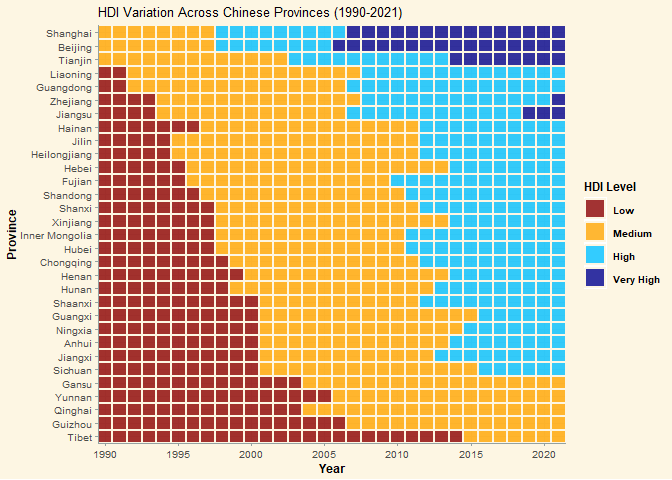
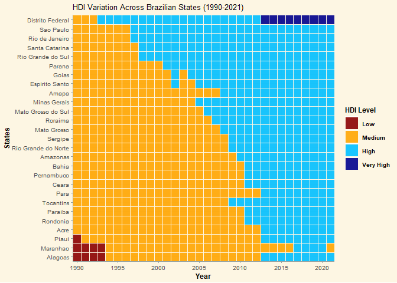
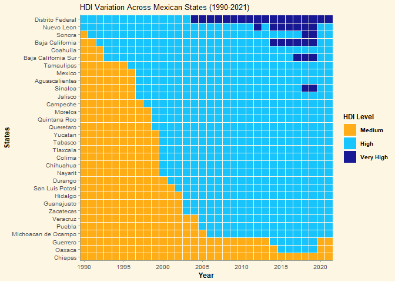
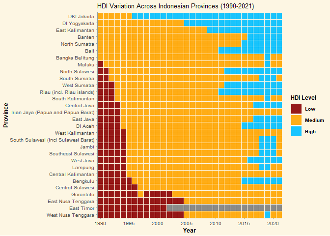

This project aimed to create an visually engaging analysis of the Human
Development Index (HDI) across subnational regions in four major
countries: China, India, Mexico, and Brazil. By
focusing on subnational regions, this analysis provides a comprehensive
view of the socio-economic landscape, identifying pockets of both
advancement and deprivation.

Source: Data retrieved from the Subnational HDI Database of the Global
Data Lab, <https://globaldatalab.org/shdi/>, version v7.0. Smits, J. and
Permanyer, I. The Subnational Human Development Database. Sci. Data.
6:190038 <https://doi.org/10.1038/sdata.2019.38> (2019).

