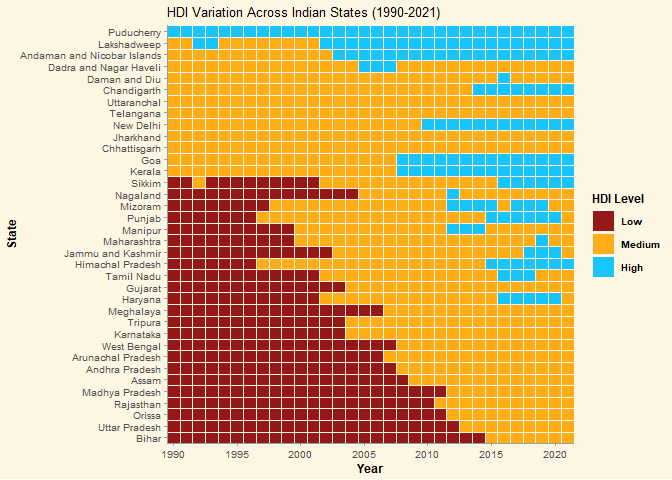

This project, completed in R, aimed to generate a visually captivating analysis of the Human Development Index (HDI) across subnational regions in five large and diverse developing countries: China, Brazil, Mexico, India, and Indonesia.  By focusing on subnational differences, the analysis sought to offer a comprehensive perspective of the socio-economic situation within these 5 countries, showcasing both overarching trends and localized pockets of progress and deprivation that might be obscured in broader national-level analyses.

Source: Data retrieved from the Subnational HDI Database of the Global
Data Lab, <https://globaldatalab.org/shdi/>, version v7.0. Smits, J. and
Permanyer, I. The Subnational Human Development Database. Sci. Data.
6:190038 <https://doi.org/10.1038/sdata.2019.38> (2019).

